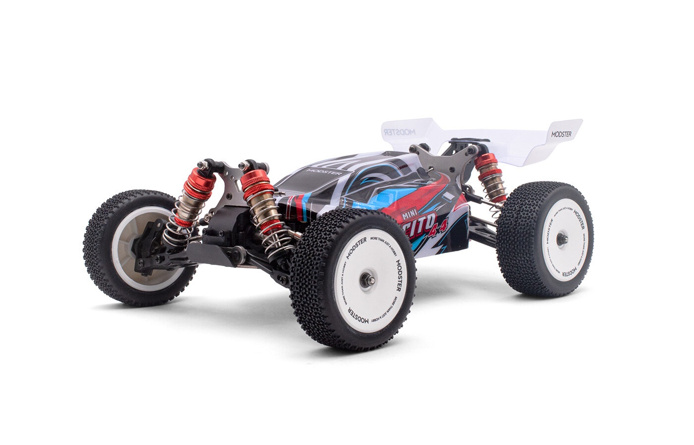

# High Performance Self-Driving RC Car Project
This is the repository for the software component of Sean Breen's Electronic and Computer Engineering Masters project. This project is concerned with the creation of a self-driving system, to autonomously control a high performance RC car and navigate a closed course scale race track. 

This project is powered using an Nvidia Jetson Nano 4GB with a CSI connected PIcam, and an Arduino Uno. Leveraging the OpenCV image processing library, an input video feed is taken onboard the vehicle, processed, and reacted to in real-time by controlling the steering servo and brushless motor of the RC car.

## Table of Contents
1. [Project Details](#project-details)
2. [Setup](#setup)
3. [Testing](#testing)
4. [Results](#results)
5. [Acknowledgements](#acknowledgements)

## Project Details
This project leverages the image processing ability of the Jetson Nano, with its discrete GPU, to process inbound frames from a Raspberry PI camera, to recognise course markers and inform control decisions of the RC car.  

### Hardware Details
- Nvidia Jetson Nano 4GB
- Arduino Uno
- Modster Mini Cito 4x4 RC Car
### Software Versions and Libraries Used
- Python 3.6.9 or newer
- OpenCV Version 4.XX compiled with CUDA enabled

## Setup
TBC
## Testing
TBC
## Results
TBC
## Acknowledgements 
I would like to acknowledge the input of project supervisor Professor Martin Glavin, whose guidance throughout the course of completing this project has been invaluable. 

I would also like to thank Dr. Darragh Mullins for his input, especially in the harware selection process, which greatly expedited the completion of much of the early work in this project. 
